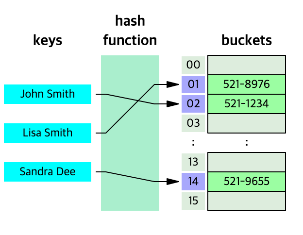

# 자료구조(Data Structure)

## 목차

- [ ] [배열(Array)과 연결리스트(Linked list)](#배열array과-연결리스트linked-list)

- [ ] [스택(Stack)과 큐(Queue)](#스택stack과-큐queue)

- [ ] [트리(Tree)와 그래프(Graph)](#트리tree와-그래프graph)

- [ ] [해시 테이블(Hash Table)](#해시-테이블hash-table)

## 배열(Array)과 연결리스트(Linked list)

### 배열(Array)

배열은 같은 타입의 변수들로 이루어진 유한집합으로 가장 기본적인 자료구조이다.

배열을 구성하는 각각의 값을 배열 요소(element)라고 하고, 배열에서의 위치를 가리키는 숫자는 인덱스(index)라고 한다.

c언어에서 인덱스는 0부터 시작하고, 0을 포함한 양의 정수만을 가질 수 있다.

찾고자 하는 원소의 인덱스를 알고 있으면, 해당 원소에 접근하기 쉽다.(random access 가능)

### 연결리스트(Linked list)

연결리스트는 각 노드가 데이터와 포인터를 가지고 한 줄로 연결되어 있는 방식으로 데이터를 저장하는 자료구조이다.

노드가 연결되어 있고, 노드의 포인터가 다음이나 이전의 노드와 연결한다.

노드는 구조체를 선언하여 노드의 데이터의 종류와 포인터를 선언한다.

연결리스트는 노드의 중간 지점에서 자료의 추가와 삭제가 용이하다.

단일 연결리스트는 각 노드에 자료 공간과 한 개의 포인터 공간이 있고, 각 노드의 포인터는 다음 노드를 가리킨다.

이중 연결리스트는 포인터의 공간이 2개가 있고, 각 포인터는 노드의 앞과 노드의 뒤를 가리킨다.

원형 연결리스트는 일반적인 연결리스트에 마지막 노드와 처음 노드를 연결시켜 원형으로 만든 구조이다.

### 배열과 연결리스트 비교

|  배열  |연결리스트|
|:--|:--|
|배열의 크기를 선언한 뒤, 변경이 어렵다.|노드를 추가하여 리스트의 길이를 조절할 수 있다.|
|배열의 원소를 추가, 삭제하는 데에 O(1) 이상의 시간이 소요된다.|리스트의 중간 지점에서 노드의 추가, 삭제를 O(1) 시간만 소요된다.|
|인덱스 값을 알고 있으면, random access가 가능하다.|원하는 위치를 찾기위해 첫번째 노드부터 탐색해야한다.|
|메모리 주소가 연속적이고 순차적이다.|메모리 주소가 랜덤하게 정해진다.|

---

## 스택(Stack)과 큐(Queue)

### 스택(Stack)

스택은 제한적으로 접근할 수 있는 나열구조이다.

스택은 한 쪽 끝에서만 자료를 넣거나 뺄 수 있는 선형구조로, 후입선출(Last In First Out, LIFO) 형식의 자료구조이다.

자료를 넣는 것을 푸쉬(push), 자료를 꺼내는 것을 팝(pop)이라고 하고, 가장 최근에 푸쉬한 자료부터 나온다.

스택은 배열과 연결리스트를 이용하여 구현할 수 있다.

### 큐(Queue)

큐는 사람들이 일렬로 늘어선 줄을 연상한다.

큐는 먼저 집어 넣은 데이터가 먼저 나오는 선입선출(First In First Out, FIFO) 형식의 자료구조이다.

주로 순서를 보장하기 위한 처리가 필요할 때 사용된다.

큐는 배열과 연결리스트를 이용하여 구현할 수 있다.

선형 큐는 막대 모양의 큐로 크기가 제한되어 있고, 빈 공간을 사용하려면 자료의 이동이 필요하다.

환형 큐는 선형 큐의 오버플로우 문제를 보완한 형태로, 막대모양의 큐를 원형으로 연결한 것이다. 

### 스택과 큐 비교

|  스택  |  큐  |
|:--|:--|
|후입선출|선입선출|
|push, pop|put, get|
|마지막에 삽입한 요소를 가장 먼저 삭제한다.|마지막에 삽입한 요소를 삭제하려면 앞의 요소를 모두 삭제해야한다.|

---

## 트리(Tree)와 그래프(Graph)

### 트리(Tree)

트리는 그래프의 일종으로 회로가 없고, 서로 다른 두 노드를 잇는 길이 하나뿐인 그래프를 트리라고 한다.

정점(node)과 선분(branch)을 이용하여 나타내는 자료구조이다.

트리는 계층 구조로 부모노드와 자식노드가 존재하고, 서로 다른 노드를 연결하는 선을 선분이라고 한다.

* 루트노드(root node)      : 부모가 없는 노드, 하나의 루트노드를 갖는다.
* 단말노드(leaf node)      : 자식이 없는 노드
* 내부노드(internal node)  : 단말노드가 아닌 노드
* 간선(edge)              : 노드를 연결하는 선
* 형제노드(sibling node)   : 같은 부모를 가지는 노드
* 조상노드(ancestors node) : 임의의 노드에서 루트노드에 이르는 경로상에 있는 노드들
* 노드의 크기(size)        : 자신을 포함한 모든 자손 노드의 개수
* 노드의 깊이(depth)       : 루트노드에서 어떤 노드에 도달하기 위해 거쳐야하는 간선의 수
* 노드의 레벨(level)       : 트리의 특정 깊이를 가지는 노드의 집합
* 노드의 차수(degree)      : 각 노드에서 뻗어나온 가지의 수
* 트리의 차수(degree)      : 트리에서 가장 큰 차수
* 트리의 높이(height)      : 가장 깊숙히 있는 노드의 깊이

이진 트리(Binary tree) : 부모 노드가 자식 노드를 최대 2개씩만 가지는 트리이다. 정렬된 배열의 이진 탐색의 경우 O(log n)이 소요된다.

정이진트리(Full binary tree) : 각 내부 노드가 두 개의 자식 노드를 갖는 순서화된 트리이다.(= 적정이진트리, propoer binary tree)

완전이진트리(complete binary tree) : 부모, 왼쪽 자식노드, 오른쪽 자식노드 순서대로 채워지는 트리를 말한다.

포화이진트리(perfect binary tree) : 모든 리프 노드의 레벨이 동일하고, 모든 레벨이 가득 채워져있는 이진트리를 말한다.

이진탐색트리(binary search tree) : 왼쪽 서브트리는 그 노드의 값보다 작은 값을 가진 노드들로, 오른쪽 서브트리는 큰 값을 가진 노드들로 구성된 트리이다.

### 그래프(Graph)

그래프는 노드와 그 노드를 연결하는 간선을 하나로 모아놓은 것으로 연결되어 있는 객체 간의 관계를 표현할 수 있는 자료구조이다.

그래프는 여러 개의 고립된 부분 그래프로 구성될 수 있다.

그래프는 네트워크 모델로 부모와 자식 관계의 개념이 없고, 2개 이상의 경로가 가능하다.

노드들 사이에 방향과 무방향의 경로를 가질 수 있다.

* 정점(vertex)              : 위치(= node)
* 간선(edge)                : 위치 간의 관계로 노드를 연결하는 선(= link, branch)
* 인접 정점(adjacent vertex) : 간선에 의해 직접 연결된 정점
* 정점의 차수(dgree)         : 방향이 없는 그래프에서 하나의 정점에 인접한 정점의 수
* 진입차수(in-degree)        : 방향 그래프에서 외부에서 오는 간선의 수(= 내차수)
* 진출차수(out-degree)       : 방향 그래프에서 외부로 향하는 간선의 수(= 외차수)
* 경로 길이(path length)     : 경로를 구성하는 데 사용된 간선의 수
* 단순 경로(simple path)     : 경로 중에서 반복되는 정점이 없는 경우
* 사이클(cycle)             : 단순 경로의 시작 정점과 종료 정점이 동일한 경우

무방향 그래프 : 간선에 방향성이 존재하지 않으므로 간선을 통해서 양 방향으로 갈 수 있다.

방향 그래프 : 간선에 방향성이 존재하는 그래프로 해당 방향으로만 갈 수 있다.

### 트리와 그래프

|  트리  |  그래프  |
|:--|:--|
|DGA(방향이 있는 비순환 그래프)그래프의 한 종류|노드와 간선을 하나로 모아 놓은 자료구조|
|방향 그래프|방향 그래프, 무방향 그래프|
|비순환 그래프|사이클, 자체 간선 모두 가능 순환 그래프와 비순환 그래프 모두 가능|
|하나의 루트 노드만 존재하고, 부모노드와 자식노드 개념이 있다.|루트 노드가 없고, 부모, 자식의 개념이 없다.|
|계층 모델|네트워크 모델|
|두 노드 간의 경로는 유일하다.|두 노드 간의 경로가 없을 수 도, 여러 개일 수 도 있다.|

---

## 해시 테이블(Hash Table)

* reference : https://ko.wikipedia.org/wiki/%ED%95%B4%EC%8B%9C_%ED%85%8C%EC%9D%B4%EB%B8%94

해시 테이블은 컴퓨터에서 키를 값에 매핑할 수 있는 구조인, 연관 배열 추가에 사용되는 자료 구조이다.

해시 테이블은 해시 함수를 사용하여 색인(index)을 버킷(buckets)이나 슬롯(slot)의 배열로 계산한다.

즉, key와 value를 1대 1로 연관하여 저장하는 연관배열 구조로 key 값을 이용하여 value를 도출할 수 있다.

* key : 고유한 값으로 효율성을 위해 hash function을 이용하여 hash로 변경하여 저장한다.
* hash function : key 값을 hash로 바꿔주는 역할을 한다. 해시 충돌이 발생할 확률을 줄이는 것이 중요하다.
* hash : hash function의 결과로 저장소에서 value 값과 매칭되어 저장된다.
* value : 저장소에 최종적으로 저장되는 값으로 키와 매칭되어 저장, 삭제, 검색 등이 가능하다.

### 해시 충돌(Hash Collision)

해시 충돌은 서로 다른 key 값이 hash function을 통해 같은 hash 값을 갖는 경우를 말한다.

충돌이 많아질수록 탐색의 시간 복잡도가 O(1)에서 O(n)으로 증가한다.

### 해시 충돌 해결방법

#### 분리 연결법(Separate Chaining)

JDK(java development kit) 내부에서 사용하는 충돌 처리 방식이다.

연결리스트(linked list) 또는 Red-Black Tree(노드가 8개 이상인 경우) 를 사용한다.

동일한 해시 값으로 충돌이 발생하면, 그 해시 값이 가리키는 연결리스트에 노드를 추가하여 값을 저장한다.

데이터를 추출할 때는, key에 대한 hash 값을 구한 뒤 해시 값이 가리키고 있는 연결리스트를 선형 검색하여 해당 key에 대한 데이터를 검색하여 리턴한다.

연결리스트 구조를 사용하고 있기 때문에, 추가할 수 있는 데이터의 수에 제약이 없다.

#### 개방 주소법(Open Addressing)

해시 충돌이 발생하면, 다른 해시 버킷에 해당 자료를 삽입하는 방식이다.

개방 주소법은 충돌이 발생하면 데이터를 저장할 장소를 찾아 헤맨다.

최악의 경우, 비어있는 버킷을 찾지 못하고 탐색을 시작한 위치까지 되돌아 올 수 있다.

비어있는 버킷을 탐색하는 방법에는 linear probing, quadratic probing, double hashing probing 방법이 있다.

분리 연결법에 비해 메모리 사용량이 적고, 캐시 효율이 높다.

개방 주소법은 분리 연결법보다 느리고, 해시 버킷의 밀도가 높아질수록 비어있는 버킷을 찾지 못할 가능성이 높다.

linear probing : 순차적으로 탐색하여 비어있는 버킷을 찾을 때까지 계속 진행한다.

quadratic probing : 2차 함수를 이용하여 탐색할 위치를 찾는다.

double hashing probing : 하나의 해시 함수에서 충돌이 발생하면 2차 해시 함수를 이용해 새로운 주소를 할당한다. 많은 연산량이 요구된다.

#### 해시 버킷 동적 할당(Resizing)

저장 공간이 일정 수준 채워지면 분리 연결법의 경우 성능 향상의 위해, 개방 주소법의 경우 배열의 크기 확장을 위해 메모리 공간을 2배로 늘린다.

확장 임계점은 현재 데이터의 수가 hash bucket 개수의 75% 가 되는 시점이다.

---

