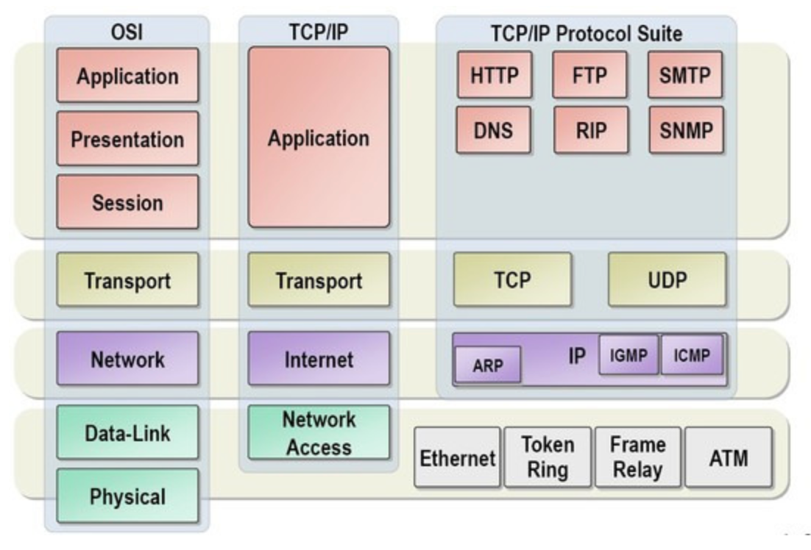

# 네트워크(Network)

## 목차

- [ ] [OSI 7계층](#osi-7계층)

## OSI 7계층

* reference : https://github.com/WeareSoft/tech-interview/blob/master/contents/network.md#osi-7%EA%B3%84%EC%B8%B5

OSI(Open System Interconnection) 7계층은 네트워크 프로토콜 디자인과 통신을 계층으로 나눈 것으로 네트워크에서 통신이 일어나는 과정을 7단계로 나눈 것을 말한다.

계층을 나누어 통신이 일어나는 과정을 단계별로 파악할 수 있고, 이상이 생긴 경우, 해당 단계만을 수정하여 해결할 수 있다.

각 계층은 하위 계층(1 ~ 4계층)의 기능만을 이용하고, 상위 계층(5 ~ 7계층)에게 기능을 제공한다.

일반적으로 하위 계층은 하드웨어로, 상위 계층은 소프트웨어로 구현된다.

### 1. 물리 계층(Physical Layer)

네트워크의 기본 네트워크 하드웨어 전송 기술을 이룬다.

네트워크의 높은 수준의 기능의 논리 데이터 구조를 기초로 하는 필수 계층이다.

전송 단위는 Bit이다.

데이터를 전기적인 신호로 변환해서 주고받는 기능을 한다.

대표적인 장비로 통신 케이블, 리피터, 허브 등이 있다.

### 2. 데이터 링크 계층(Data Link Layer)

포인트 투 포인트 간 신뢰성있는 전송을 보장하기 위한 계층이다.

네트워크 위의 개체들 간 데이터를 전달하고, 물리 계층에서 발생 할 수 있는 오류를 찾고, 수정하는 데 필요한 기능적, 절차적 수단을 제공한다.

에러 검출, 재전송, 흐름 제어 기능이 있다.

할당 받은 맥 주소(MAC address, Media Access Control Address)로 통신을 한다. 

맥 주소는 네트워크 세그먼트의 데이터 링크 계층에서 통신을 위한 네트워크 인터페이스에 할당된 고유 식별자이다.

데이터 전송 단위는 프레임(Frame)이다.

대표적인 데이터 링크 계층으로 이더넷, HDLC, ADCCP 등이 있다.

### 3. 네트워크 계층(Network Layer)

경로를 찾아주는 역할을 하는 계층이다.

다양한 길이의 데이터를 네트워크를 통해 전달하고, 그 과정에서 전송 계층이 요구하는 서비스 품질을 제공하기 위한 기능적, 절차적 수단을 제공한다.

라우팅, 흐름 제어, 세그멘테이션, 오류 제어, 인터네트워킹 등을 수행한다.

데이터를 연결하는 다른 네트워크를 통해 전달하여 인터넷이 가능하게 만드는 계층이다.

네트워크 관리자가 직접 주소(IP, 논리적인 주소 구조)를 할당하는 구조로 계층적이다.

네트워크 연결을 설정, 유지, 해제하는 기능을 부여하고, 전송 계층 사이에 네트워크 서비스 데어ㅣ터 유닛을 교환하는 기능을 제공한다.

대표적인 장비로 라우터가 있고, 3 Layer 스위치도 있다.

데이터 전송 단위는 Datagram(Packet, 패킷)이다.

### 4. 전송 계층(Transport Layer)

양 끝단(end to end)의 사용자들이 신뢰성있는 데이터를 주고 받을 수 있도록 하여 상위 계층들이 데이터 전달의 유효성이나 효율성을 생각하지 않도록 한다.

시퀀스 넘버 기반의 오류 제어 방식을 사용한다.

특정 연결의 유효성을 제어하고, 일부 프로토콜은 상태 개념이 있고, 연결 기반이다.

패킷의 전송이 유효한지 확인하고, 전송 실패한 패킷들을 다시 전송한다.

즉, 오류검출 및 복구, 흐름제어, 중복검사 등을 수행한다.

대표적으로 TCP가 있다.

데이터 전송 단위는 세그먼트(Segment)이다.

### 5. 세션 계층(Session Layer)

양 끝단의 응용 프로세스가 통신을 관리하기 위한 방법을 제공한다.

TCP/IP 세션을 만들고 없애는 책임을 가진다.

통신하는 사용자들을 동기화하고 오류복구 명령들을 일괄적으로 다룬다.

### 6. 표현 계층(Presentation Layer)

코드 간의 번역을 담당하여 사용자 시스템에서 데이터의 형식상 차이를 다루는 부담을 응용 계층으로부터 덜어준다.

MIME 인코딩이나 암호화 등의 동작이 이 계층에서 이루어진다. (ex) EBCDIC --> ASCII)

### 7. 응용 계층(Application Layer)

응용 프로세스와 직접 관계하여 일반적인 응용 서비스를 수행한다.

일반적인 응용 서비스는 관련된 응용 프로세스들 사이의 전환을 제공한다.

최종 목적지로 HTTP, FTP, SMTP, POP3, IMAP, Telnet 와 같은 프로토콜이 있다.

통신의 양 끝단은 응용프로그램이 아닌 프로토콜이다.

---

